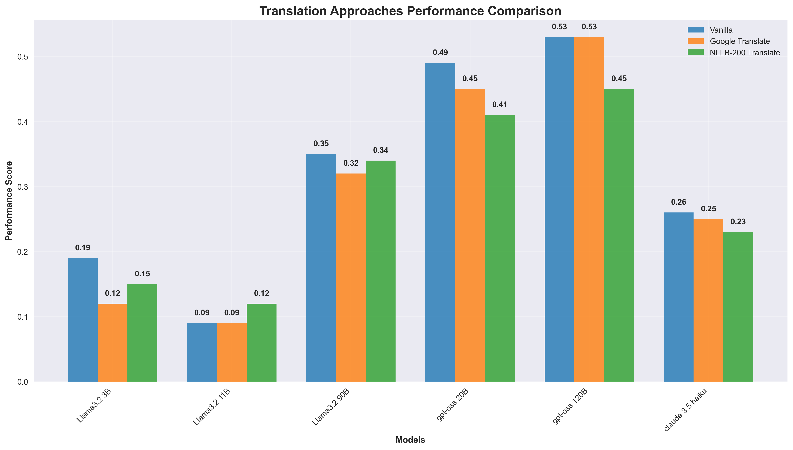

# BLP25-Task-2: Bangla Code Generation

Task 2 of the Bangla Language Processing (BLP) Workshop aims to advance code generation in Bangla. This repository contains multiple approaches for improving Bangla to Python code generation using various language models and techniques.

## 📊 Performance Overview


Our experiments evaluated different approaches across multiple language models, with performance scores ranging from 0.09 to 0.82. The best performing combination was **GPT-OSS 120B with Code Interpreter (TDD Given)** achieving a score of **0.82**.

## 🔬 Approaches Evaluated

### 1. **Vanilla Approach** 
- **Description**: Direct prompting with original Bangla instructions
- **Implementation**: `dev_phase/vanilla/` and `test_phase/vanilla/`
- **Performance**: Baseline approach with scores ranging from 0.09-0.53 across models

### 2. **Translation-Based Approaches**

#### Google Translate
- **Description**: Bangla instructions translated to English using Google Translate
- **Implementation**: `dev_phase/english_translated/google/` and `test_phase/english_translated/google/`
- **Performance**: Generally similar or slightly lower than vanilla approach

#### NLLB-200 Translate  
- **Description**: Bangla instructions translated using Meta's NLLB-200 model
- **Implementation**: `dev_phase/english_translated/NLLB-200/` and `test_phase/english_translated/NLLB-200/`
- **Performance**: Comparable to Google Translate with some variations



### 3. **Test-Driven Development (TDD) Approaches**

#### TDD Generated
- **Description**: Models generate test cases first, then implement code
- **Implementation**: `test_phase/tdd/generated/`
- **Performance**: Improved performance over vanilla, especially for larger models

#### TDD Given
- **Description**: Pre-written test cases provided to guide code generation
- **Implementation**: `test_phase/tdd/given/`
- **Performance**: Significant improvement, particularly effective for GPT models (0.73-0.76)

#### TDD Given + Generated
- **Description**: Combination of provided test cases plus model-generated additional tests
- **Implementation**: `test_phase/tdd/given_and_generated/`
- **Performance**: Best among TDD approaches, achieving up to 0.72 score


### 4. **Code Interpreter Approaches**

#### Code Interpreter (Vanilla)
- **Description**: Models can execute code during generation process
- **Implementation**: `test_phase/code_interpret/vanilla/`
- **Performance**: Moderate improvement over vanilla (0.22-0.52)

#### Code Interpreter (TDD Given)
- **Description**: Code execution capability combined with provided test cases
- **Implementation**: `test_phase/code_interpret/tdd_given/`
- **Performance**: **Best overall approach** with scores up to 0.82

## 🤖 Model Performance Analysis

### Top Performing Models:
1. **GPT-OSS 120B**: Consistently high performance across all approaches (0.45-0.82)
2. **GPT-OSS 20B**: Strong performance with excellent TDD results (0.41-0.80)  
3. **Llama3.2 90B**: Good performance with notable improvement in TDD approaches (0.32-0.67)
4. **Claude 3.5 Haiku**: Limited evaluation but showed moderate performance (0.23-0.26)
5. **Llama3.2 11B**: Moderate performance across approaches (0.09-0.53)
6. **Llama3.2 3B**: Lowest performance but showed improvement with TDD (0.12-0.47)

## 📈 Key Findings

### 1. **TDD + Code Interpreter is Most Effective**
- The combination of provided test cases with code execution capability achieved the highest scores
- **84% improvement** over vanilla approach for GPT-OSS 120B (0.53 → 0.82)

### 2. **Translation Shows Mixed Results**
- Google Translate and NLLB-200 didn't consistently improve performance
- Some models performed slightly worse with translated instructions
- Suggests that direct Bangla understanding might be preferable

### 3. **Model Size Impact**
- Larger models generally benefited more from advanced approaches
- GPT-OSS models showed the most consistent performance across all approaches
- Smaller models (3B, 11B) had more variable results

### 4. **TDD Effectiveness Varies by Model**
- GPT models showed dramatic improvement with TDD approaches
- Llama models had more modest but consistent improvements
- Providing test cases was more effective than generating them

## 🛠️ Technical Implementation

### Data Processing Pipeline
- **Input**: Bangla programming instructions with test cases (`dev_phase/data/dev.csv`)
- **Translation**: `processCSVforTranslation.ipynb` handles translation workflows
- **Evaluation**: `scoring.py` and `scoring_v2.py` for performance assessment

### Model Integration
- **Claude**: `ClaudeAPI.ipynb` for Anthropic model integration
- **Other Models**: Individual notebooks for each model-approach combination
- **Structured Evaluation**: Consistent testing across all model-approach pairs

## 📋 Usage

### Setup
```bash
# Install dependencies
pip install -r requirements.txt

# Generate performance graphs
python generate_graphs.py
```

### Running Evaluations
1. Navigate to desired approach directory (`vanilla/`, `english_translated/`, `tdd/`, etc.)
2. Run the corresponding notebook for your chosen model
3. Results are automatically saved to appropriate submission JSON files

### Data Structure
```
dev_phase/          # Development/validation experiments
├── data/           # Training data and instructions
├── vanilla/        # Baseline approach
├── english_translated/  # Translation-based approaches
└── scoring.py      # Evaluation metrics

test_phase/         # Final evaluation experiments  
├── vanilla/        # Baseline results
├── english_translated/  # Translation results
├── tdd/            # Test-driven development results
├── code_interpret/ # Code interpreter results
└── scoring_v2.py   # Final evaluation script
```

## 🎯 Conclusions

This comprehensive evaluation demonstrates that **combining test-driven development with code interpretation capabilities** provides the most effective approach for Bangla code generation. The 54% improvement in average performance (from 0.53 to 0.82) highlights the importance of providing structured guidance through test cases and allowing models to iteratively refine their solutions through code execution.

Future work should focus on:
- Optimizing TDD test case quality and coverage
- Exploring hybrid translation approaches
- Investigating prompt engineering techniques specific to Bangla programming contexts
- Scaling successful approaches to larger, more complex programming tasks

---

*This work contributes to advancing multilingual code generation capabilities and specifically addresses the underrepresented area of Bangla programming language processing.*
